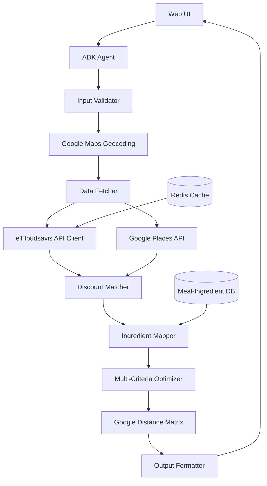

# Design Document

## Overview

The Shopping Optimizer is a web-based intelligent agent system built using Google ADK (Agent Development Kit) that processes user inputs (location, meal plans, preferences) and generates optimized shopping recommendations by analyzing real-time discount data from eTilbudsavis API and store locations via Google Maps API. The system uses a multi-stage pipeline: input validation → data fetching → discount matching → ingredient identification → optimization → output formatting.

The architecture follows a modular design with clear separation between data models, external API integrations, business logic, optimization algorithms, and presentation layers.

## Architecture

### High-Level Architecture



### Component Layers

1. **Presentation Layer**: Web UI built with ADK's web interface
2. **Agent Layer**: Google ADK agent orchestrating the optimization workflow
3. **Integration Layer**: External API clients (eTilbudsavis, Google Maps)
4. **Business Logic Layer**: Core optimization algorithms and matching logic
5. **Data Layer**: Cache and meal-ingredient mappings

## Components and Interfaces

### 1. Data Models

#### UserInput
```python
@dataclass
class UserInput:
    location: Location
    meal_plan: List[str]
    preferences: OptimizationPreferences
    timeframe: Timeframe
```

#### Location and Preferences
```python
@dataclass
class Location:
    latitude: float
    longitude: float
    
@dataclass
class OptimizationPreferences:
    maximize_savings: bool
    minimize_stores: bool
    prefer_organic: bool
    
@dataclass
class Timeframe:
    start_date: date
    end_date: date
```

#### DiscountItem
```python
@dataclass
class DiscountItem:
    product_name: str
    store_name: str
    store_location: Location
    original_price: float
    discount_price: float
    discount_percent: float
    expiration_date: date
    is_organic: bool
```

#### ShoppingRecommendation
```python
@dataclass
class ShoppingRecommendation:
    purchases: List[Purchase]
    total_savings: float
    time_savings: float
    tips: List[str]
    motivation_message: str
    
@dataclass
class Purchase:
    product_name: str
    store_name: str
    purchase_day: date
    price: float
    savings: float
    meal_association: str
```

### 2. Core Components

#### InputValidator
**Responsibility**: Validate and sanitize user inputs

**Interface**:
```python
class InputValidator:
    def validate(self, raw_input: Dict) -> UserInput
    def validate_location(self, lat: float, lon: float) -> bool
    def validate_meal_plan(self, meals: List[str]) -> bool
    def validate_timeframe(self, timeframe: str) -> Timeframe
```

**Key Logic**:
- Validate latitude (-90 to 90) and longitude (-180 to 180)
- Ensure meal plan is non-empty
- Parse timeframe strings ("this week", "next 7 days") into date ranges
- Ensure at least one optimization preference is selected

#### ETilbudsavisAPIClient
**Responsibility**: Fetch real-time discount data from eTilbudsavis API

**Interface**:
```python
class ETilbudsavisAPIClient:
    def fetch_campaigns(self, location: Location, radius_km: float) -> List[DiscountItem]
    def parse_campaign_response(self, json_data: dict) -> List[DiscountItem]
    def get_cached_campaigns(self) -> Optional[List[DiscountItem]]
    def cache_campaigns(self, campaigns: List[DiscountItem], ttl_hours: int = 24)
```

**Key Logic**:
- API endpoint: `https://etilbudsavis.dk/api/v2/` (or appropriate endpoint)
- Parse JSON response to extract: product name, store, price, discount %, expiration date
- Cache responses for 24 hours to minimize API calls
- Handle rate limiting and API errors gracefully

**API Response Example**:
```json
{
  "offers": [
    {
      "heading": "Hakket oksekød",
      "pricing": {"price": 39.95, "pre_price": 59.95},
      "dealer": {"name": "Netto"},
      "run_from": "2025-11-10",
      "run_till": "2025-11-16"
    }
  ]
}
```

#### GoogleMapsService
**Responsibility**: Geocoding and store location services

**Interface**:
```python
class GoogleMapsService:
    def geocode_address(self, address: str) -> Location
    def find_nearby_stores(self, location: Location, radius_km: float) -> List[StoreLocation]
    def calculate_distance_matrix(self, origin: Location, destinations: List[Location]) -> Dict[str, float]
```

**Key Logic**:
- Geocoding API: Convert user address to lat/lng coordinates
- Places API: Search for grocery stores (types: "supermarket", "grocery_or_supermarket")
- Distance Matrix API: Calculate actual driving distance and time
- Cache geocoding results to minimize API calls

#### DiscountMatcher
**Responsibility**: Filter discount data from eTilbudsavis

**Interface**:
```python
class DiscountMatcher:
    def filter_by_location(self, discounts: List[DiscountItem], 
                          user_location: Location, 
                          max_distance_km: float) -> List[DiscountItem]
    def filter_by_timeframe(self, discounts: List[DiscountItem], 
                           timeframe: Timeframe) -> List[DiscountItem]
    def deduplicate_discounts(self, discounts: List[DiscountItem]) -> List[DiscountItem]
```

**Key Logic**:
- Deduplicate based on product name + store + price
- Filter by location using Google Maps distance data
- Filter discounts where expiration_date >= timeframe.start_date

#### IngredientMapper
**Responsibility**: Map meals to required ingredients and match with available products

**Interface**:
```python
class IngredientMapper:
    def get_ingredients_for_meal(self, meal_name: str) -> List[str]
    def match_products_to_ingredients(self, 
                                     ingredients: List[str], 
                                     discounts: List[DiscountItem]) -> Dict[str, List[DiscountItem]]
    def fuzzy_match(self, ingredient: str, product_name: str) -> float
```

**Key Logic**:
- Maintain a meal-to-ingredients database
- Use fuzzy string matching to match ingredients to product names
- Handle synonyms (e.g., "ground beef" matches "köttfärs")
- Return multiple discount options per ingredient

**Meal Database Example**:
```python
MEAL_INGREDIENTS = {
    "taco": ["tortillas", "ground beef", "cheese", "sour cream", "salsa", "lettuce", "tomato"],
    "pasta": ["pasta", "tomato sauce", "ground beef", "parmesan", "garlic", "onion"],
    "veggie soup": ["vegetable broth", "carrots", "celery", "onion", "potato", "beans"]
}
```

#### MultiCriteriaOptimizer
**Responsibility**: Optimize product-store combinations based on user preferences

**Interface**:
```python
class MultiCriteriaOptimizer:
    def optimize(self, 
                matches: Dict[str, List[DiscountItem]], 
                preferences: OptimizationPreferences,
                user_location: Location) -> List[Purchase]
    def calculate_score(self, 
                       purchase_option: DiscountItem, 
                       preferences: OptimizationPreferences,
                       user_location: Location) -> float
```

**Key Logic**:
- **Scoring Algorithm**: Weighted sum of normalized criteria
  - Savings score: (original_price - discount_price) / original_price
  - Distance score: 1 / (1 + distance_km)
  - Organic score: 1.0 if organic and preferred, else 0.5
  - Store consolidation bonus: +0.2 for each additional item from same store

- **Weights** (when multiple preferences selected):
  - maximize_savings: 0.5
  - minimize_stores: 0.3
  - prefer_organic: 0.2

#### OutputFormatter
**Responsibility**: Format recommendations into human-readable output

**Interface**:
```python
class OutputFormatter:
    def format_recommendation(self, recommendation: ShoppingRecommendation) -> str
    def generate_tips(self, purchases: List[Purchase]) -> List[str]
    def generate_motivation(self, savings: float, time_savings: float) -> str
```

**Key Logic**:
- Group purchases by store, then by day
- Generate tips for time-sensitive discounts and organic alternatives
- Limit to top 3 most impactful tips
- Use conversational language for readability

### 3. Web UI Components

#### Frontend Structure
```
templates/
  index.html          # Main UI page
static/
  css/
    styles.css        # UI styling
  js/
    app.js           # Client-side logic
```

#### UI Component Breakdown

**Input Form**:
- Location input: Text field for coordinates or city name
- Meal plan input: Textarea for meal list
- Optimization checkboxes: Cost, Time, Quality
- Optimize button: Primary action button

**Results Display**:
- Shopping list section: Grouped by store and day
- Savings summary: Highlighted box with monetary and time savings
- Tips section: Bulleted list of actionable tips
- Motivation message: Friendly closing statement

## Error Handling

### Validation Errors
- **Missing required fields**: Clear message indicating which fields are required
- **Invalid location**: "Please provide valid coordinates"
- **Empty meal plan**: "Please enter at least one meal"
- **No preferences selected**: "Please select at least one optimization preference"

### Processing Errors
- **No discounts found**: "No discounts available in your area"
- **No matching products**: "We couldn't find discounts matching your meal plan"
- **Optimization failure**: Fallback to simple savings-based ranking

## Testing Strategy

### Unit Tests
1. **ETilbudsavisAPIClient**: Test API response parsing, caching logic, error handling
2. **EmailCampaignParser**: Test Gemini prompt construction, JSON extraction, image handling
3. **GoogleMapsService**: Test geocoding, places search, distance matrix parsing
4. **InputValidator**: Test validation logic for all input fields
5. **DiscountMatcher**: Test aggregation, deduplication, filtering
6. **IngredientMapper**: Test meal-to-ingredient mapping and fuzzy matching
7. **MultiCriteriaOptimizer**: Test scoring algorithm with different preferences
8. **OutputFormatter**: Test output formatting and tip generation

### Integration Tests
1. End-to-end optimization flow with real API calls (use test API keys)
2. Email parsing flow: Gmail API → Gemini → Database storage
3. Hybrid data flow: eTilbudsavis + Email campaigns → Optimization
4. Multi-preference optimization scenarios
5. Edge cases: No email campaigns, API failures, no nearby stores

### API Mocking for Development
- Use mock responses for eTilbudsavis during development
- Mock Gmail API with sample promotional emails
- Mock Google Maps responses with Copenhagen test data
- Switch to real APIs via environment variable flag

## API Configuration

### Required API Keys and Services

1. **eTilbudsavis API**
   - Endpoint: `https://etilbudsavis.dk/api/v2/`
   - Authentication: API key (if required) or public access
   - Rate limits: Check documentation
   - Environment variable: `ETILBUDSAVIS_API_KEY`

2. **Google Maps APIs**
   - Geocoding API: Convert addresses to coordinates
   - Places API: Find nearby grocery stores
   - Distance Matrix API: Calculate travel distances
   - Environment variable: `GOOGLE_MAPS_API_KEY`
   - Enable all three APIs in Google Cloud Console

### Environment Variables (.env)
```
ETILBUDSAVIS_API_KEY=your_key_here
GOOGLE_MAPS_API_KEY=your_key_here
REDIS_URL=redis://localhost:6379
```

## Data Models

### Extended DiscountItem
```python
@dataclass
class DiscountItem:
    product_name: str
    store_name: str
    store_location: Location
    store_address: str  # NEW: Full address from Google Maps
    original_price: float
    discount_price: float
    discount_percent: float
    expiration_date: date
    is_organic: bool
    travel_distance_km: float  # NEW: From Google Maps
    travel_time_minutes: float  # NEW: From Google Maps
```

## Design Decisions

### 1. Google Maps Integration
**Rationale**: Provides accurate real-world distances and travel times, improving optimization quality

### 2. Redis Caching
**Rationale**: Reduces API calls to eTilbudsavis (24h cache) and Google Maps (geocoding cache), improves performance and reduces costs

### 3. Multi-Criteria Scoring
**Rationale**: Flexible optimization, handles conflicting preferences gracefully

### 4. Fuzzy Ingredient Matching
**Rationale**: Handles variations in product naming, supports multiple languages
