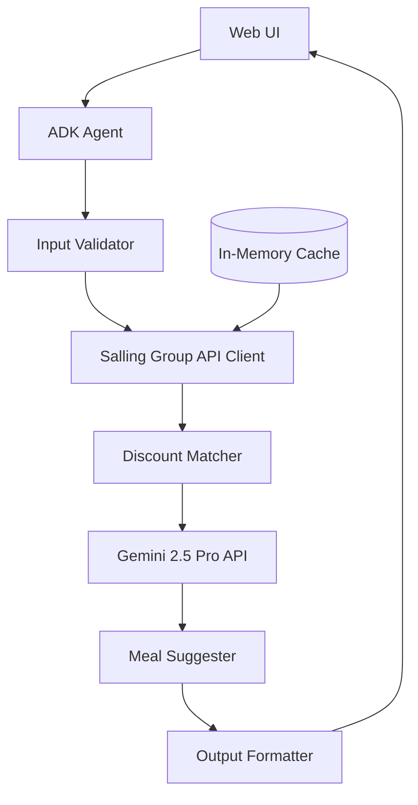

# Design Document

## Overview

The Shopping Optimizer is a web-based intelligent agent system that fetches food waste discounts from Salling Group API within 2km of the user's location, then uses Gemini 2.5 Pro to generate creative meal suggestions based on available products. The system uses a simplified pipeline: location input → fetch food waste data (2km radius) → AI meal generation → output formatting.

The architecture follows a modular design with clear separation between data models, external API integrations (Salling Group + Gemini), and presentation layers. Geographic calculations use the Haversine formula for distance estimation.

## Architecture

### High-Level Architecture



### Component Layers

1. **Presentation Layer**: Web UI built with Flask
2. **Agent Layer**: ADK agent orchestrating the food waste → meal suggestion workflow
3. **Integration Layer**: External API clients (Salling Group, Gemini 2.5 Pro)
4. **Business Logic Layer**: Discount filtering and meal suggestion formatting
5. **Data Layer**: In-memory cache for API responses (24h TTL)

## Components and Interfaces

### 1. Data Models

#### UserInput
```python
@dataclass
class UserInput:
    location: Location
    radius_km: float = 2.0  # Fixed 2km radius
```

#### Location
```python
@dataclass
class Location:
    latitude: float
    longitude: float
```

#### DiscountItem
```python
@dataclass
class DiscountItem:
    product_name: str
    store_name: str
    store_location: Location
    original_price: float
    discount_price: float
    discount_percent: float
    expiration_date: date
    is_organic: bool
```

#### MealSuggestion
```python
@dataclass
class MealSuggestion:
    meal_name: str
    description: str
    required_products: List[DiscountItem]
    total_cost: float
    total_savings: float
    preparation_tips: str
    
@dataclass
class ShoppingRecommendation:
    meal_suggestions: List[MealSuggestion]
    total_savings: float
    tips: List[str]
    motivation_message: str
```

### 2. Core Components

#### InputValidator
**Responsibility**: Validate user location input

**Interface**:
```python
class InputValidator:
    def validate(self, raw_input: Dict) -> UserInput
    def validate_location(self, lat: float, lon: float) -> bool
```

**Key Logic**:
- Validate latitude (-90 to 90) and longitude (-180 to 180)
- Set fixed 2km radius for all searches
- No meal plan validation needed (AI-generated)

#### SallingAPIClient
**Responsibility**: Fetch real-time food waste data from Salling Group API

**Interface**:
```python
class SallingAPIClient:
    def fetch_campaigns(self, location: Location, radius_km: float = 2.0) -> List[DiscountItem]
    def parse_campaign_response(self, json_data: List[Dict]) -> List[DiscountItem]
    def get_cached_campaigns(self) -> Optional[List[DiscountItem]]
    def cache_campaigns(self, campaigns: List[DiscountItem], ttl_hours: int = 24)
```

**Key Logic**:
- API endpoint: `https://api.sallinggroup.com/v1/food-waste/`
- Fixed 2km radius parameter
- Parse JSON response to extract: product name, store, original price, discount price, expiration date, store coordinates
- Cache responses for 24 hours to minimize API calls
- Handle rate limiting (429 errors) and API errors gracefully

**API Response Example**:
```json
[
  {
    "store": {
      "name": "Netto",
      "address": {"street": "Nørrebrogade 45", "city": "København N", "zip": "2200"},
      "coordinates": [12.5537, 55.6872],
      "brand": "netto"
    },
    "clearances": [
      {
        "product": {"description": "Hakket oksekød", "ean": "123456"},
        "offer": {
          "originalPrice": 59.95,
          "newPrice": 39.95,
          "percentDiscount": 33,
          "endTime": "2025-11-15T20:00:00Z"
        }
      }
    ]
  }
]
```

#### MealSuggester
**Responsibility**: Generate meal suggestions using Gemini 2.5 Pro based on available food waste products

**Interface**:
```python
class MealSuggester:
    def suggest_meals(self, discounts: List[DiscountItem]) -> List[MealSuggestion]
    def build_gemini_prompt(self, discounts: List[DiscountItem]) -> str
    def parse_gemini_response(self, response: str) -> List[MealSuggestion]
```

**Key Logic**:
- Build prompt with all available food waste products, prices, and stores
- Request 3-5 creative meal suggestions from Gemini 2.5 Pro
- Parse AI response to extract meal names, descriptions, required products, and preparation tips
- Map suggested meals back to specific DiscountItem objects
- Handle API failures with fallback message

#### DiscountMatcher
**Responsibility**: Filter and organize food waste data from Salling Group API

**Interface**:
```python
class DiscountMatcher:
    def filter_by_location(self, discounts: List[DiscountItem], 
                          user_location: Location, 
                          max_distance_km: float = 2.0) -> List[DiscountItem]
    def calculate_distances(self, discounts: List[DiscountItem], 
                           user_location: Location) -> List[DiscountItem]
    def sort_by_distance(self, discounts: List[DiscountItem]) -> List[DiscountItem]
```

**Key Logic**:
- Use Haversine formula to calculate distances from user location
- Filter to only include stores within 2km radius
- Sort products by store distance
- Calculate and populate travel_distance_km field for each discount

#### GeminiIntegration
**Responsibility**: Interface with Gemini 2.5 Pro API for meal generation

**Interface**:
```python
class GeminiIntegration:
    def generate_meals(self, products: List[DiscountItem]) -> str
    def build_prompt(self, products: List[DiscountItem]) -> str
    def call_api(self, prompt: str) -> str
```

**Key Logic**:
- Format product list with names, prices, discounts, stores, and expiration dates
- Create structured prompt asking for 3-5 meal suggestions
- Include instructions for Gemini to consider product combinations and expiration dates
- Handle API timeouts and errors
- Return raw text response for parsing

**Example Prompt Structure**:
```
You are a creative chef helping reduce food waste. Based on these discounted products available within 2km:

1. Hakket oksekød - 39.95 DKK (was 59.95) at Netto Nørrebro, expires 2025-11-15
2. Tomater - 15.00 DKK (was 25.00) at Føtex Vesterbro, expires 2025-11-14
...

Suggest 3-5 creative meals that can be prepared using these products. For each meal, include:
- Meal name
- Brief description
- Which products to use
- Simple preparation tips
```

#### SavingsCalculator
**Responsibility**: Calculate total savings and generate insights

**Interface**:
```python
class SavingsCalculator:
    def calculate_meal_savings(self, meal: MealSuggestion) -> float
    def calculate_total_savings(self, meals: List[MealSuggestion]) -> float
    def generate_savings_summary(self, total_savings: float, product_count: int) -> str
```

**Key Logic**:
- Sum (original_price - discount_price) for all products in a meal
- Calculate total savings across all meal suggestions
- Generate motivational message about food waste reduction
- Highlight percentage savings

#### OutputFormatter
**Responsibility**: Format meal suggestions and shopping details into human-readable output

**Interface**:
```python
class OutputFormatter:
    def format_recommendation(self, recommendation: ShoppingRecommendation) -> str
    def format_meal_suggestion(self, meal: MealSuggestion) -> str
    def generate_tips(self, discounts: List[DiscountItem]) -> List[str]
    def generate_motivation(self, savings: float) -> str
```

**Key Logic**:
- Format each meal with name, description, required products, and total cost
- Group products by store for each meal
- Generate tips for products expiring soon (within 24 hours)
- Highlight highest discount percentages
- Limit to top 3 most impactful tips
- Use conversational, friendly language

### 3. Web UI Components

#### Frontend Structure
```
templates/
  index.html          # Main UI page
static/
  css/
    styles.css        # UI styling
  js/
    app.js           # Client-side logic
```

#### UI Component Breakdown

**Input Form**:
- Location input: Text field for coordinates or city name
- Meal plan input: Textarea for meal list
- Optimization checkboxes: Cost, Time, Quality
- Optimize button: Primary action button

**Results Display**:
- Shopping list section: Grouped by store and day
- Savings summary: Highlighted box with monetary and time savings
- Tips section: Bulleted list of actionable tips
- Motivation message: Friendly closing statement

## Error Handling

### Validation Errors
- **Missing required fields**: Clear message indicating which fields are required
- **Invalid location**: "Please provide valid coordinates"
- **Empty meal plan**: "Please enter at least one meal"
- **No preferences selected**: "Please select at least one optimization preference"

### Processing Errors
- **No discounts found**: "No discounts available in your area"
- **No matching products**: "We couldn't find discounts matching your meal plan"
- **Optimization failure**: Fallback to simple savings-based ranking

## Testing Strategy

### Unit Tests
1. **ETilbudsavisAPIClient**: Test API response parsing, caching logic, error handling
2. **EmailCampaignParser**: Test Gemini prompt construction, JSON extraction, image handling
3. **GoogleMapsService**: Test geocoding, places search, distance matrix parsing
4. **InputValidator**: Test validation logic for all input fields
5. **DiscountMatcher**: Test aggregation, deduplication, filtering
6. **IngredientMapper**: Test meal-to-ingredient mapping and fuzzy matching
7. **MultiCriteriaOptimizer**: Test scoring algorithm with different preferences
8. **OutputFormatter**: Test output formatting and tip generation

### Integration Tests
1. End-to-end optimization flow with real API calls (use test API keys)
2. Email parsing flow: Gmail API → Gemini → Database storage
3. Hybrid data flow: eTilbudsavis + Email campaigns → Optimization
4. Multi-preference optimization scenarios
5. Edge cases: No email campaigns, API failures, no nearby stores

### API Mocking for Development
- Use mock responses for eTilbudsavis during development
- Mock Gmail API with sample promotional emails
- Mock Google Maps responses with Copenhagen test data
- Switch to real APIs via environment variable flag

## API Configuration

### Required API Keys and Services

1. **Salling Group API**
   - Endpoint: `https://api.sallinggroup.com/v1/food-waste/`
   - Authentication: Bearer token (API key)
   - Rate limits: Monitor 429 responses
   - Environment variable: `SALLING_GROUP_API_KEY`
   - Documentation: https://developer.sallinggroup.com/

2. **Gemini 2.5 Pro API**
   - Model: gemini-2.5-pro
   - Authentication: API key
   - Environment variable: `GOOGLE_API_KEY`
   - Used for AI meal generation based on available products

### Environment Variables (.env)
```
SALLING_GROUP_API_KEY=your_salling_key_here
GOOGLE_API_KEY=your_gemini_key_here
```

## Data Models

### Extended DiscountItem
```python
@dataclass
class DiscountItem:
    product_name: str
    store_name: str
    store_location: Location
    store_address: str  # Full address from Salling API
    original_price: float
    discount_price: float
    discount_percent: float
    expiration_date: date
    is_organic: bool
    travel_distance_km: float  # Calculated using Haversine formula
    travel_time_minutes: float  # Estimated based on distance (40 km/h average)
```

## Design Decisions

### 1. Fixed 2km Radius
**Rationale**: Focuses on truly nearby stores, encourages walking/biking, reduces complexity by removing user configuration

### 2. AI-First Meal Generation
**Rationale**: Gemini 2.5 Pro generates creative meals based on what's actually available, rather than trying to match predefined meals to products

### 3. In-Memory Caching
**Rationale**: Simple 24h cache for Salling API responses reduces API calls and improves performance without external dependencies

### 4. Food Waste Focus
**Rationale**: Salling Group's food-waste endpoint provides highly discounted products that need to be sold quickly, maximizing both savings and environmental impact

### 5. Haversine Distance Calculation
**Rationale**: Simple geographic distance calculation without external API dependencies, sufficient accuracy for 2km radius
